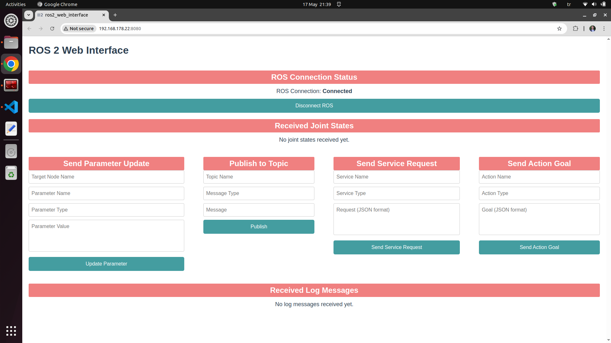

# ROS2 Web Interface


## Project Setup
```
cd ros2-web-interface/
npm install
source /opt/ros/humble/setup.bash
node node_modules/rclnodejs/scripts/generate_messages.js
```

## Frontend and Backend Execution
```
cd ros2-web-interface/
npm run serve
source /opt/ros/humble/setup.bash
node src/ros_world.js
```

## Sample Application
Desired topic, service, action, and parameter can be entered as an input.
```
source /opt/ros/humble/setup.bash
ros2 topic echo /my_topic
python3 src/ros-scripts/fibonacci_action_server.py
python3 src/ros-scripts/service_server.py
python3 src/ros-scripts/get_param.py
```


